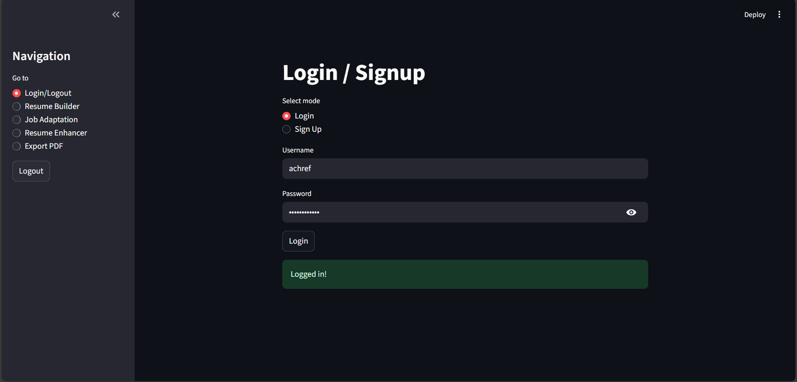
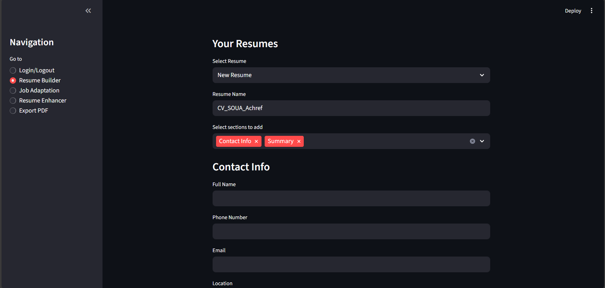
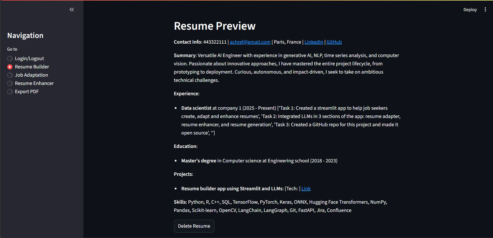
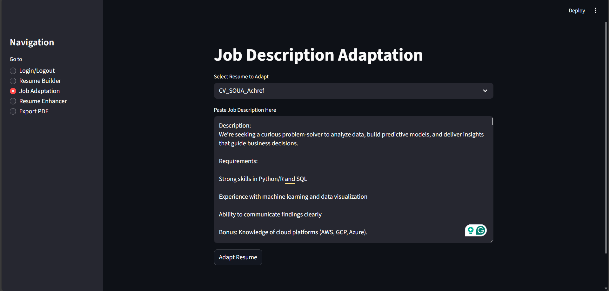
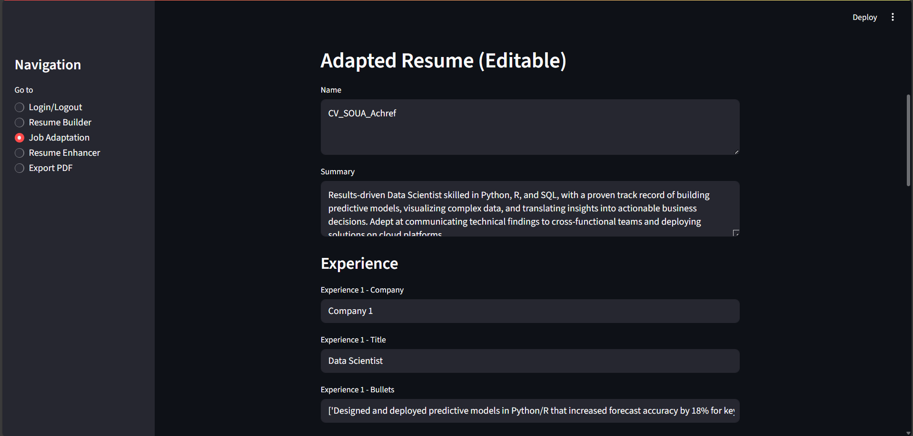
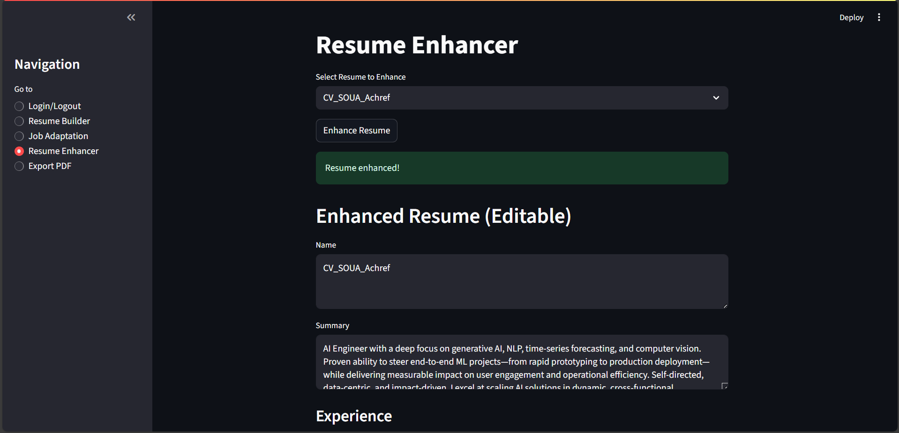
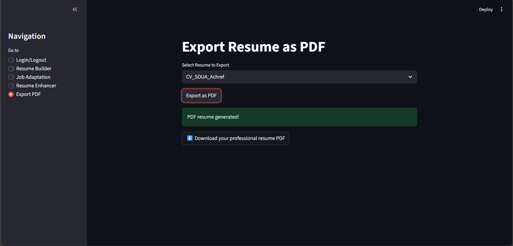

# Resume Tool App

A modular, secure, and user-friendly Streamlit application for building, editing, adapting, enhancing, and exporting resumes using Groq LLM and ReportLab.


## Features

### User Authentication
Sign up, log in, and log out securely. Passwords are hashed and stored in a private database.



### Resume Builder
Create, edit, duplicate, delete, and visualize multiple resumes. Add sections like summary, experience, education, projects, skills, certificates, publications, and contact info. Dynamic forms allow adding/removing entries and bullet points for each section. Saved resumes can be edited and updated.




### Resume Adaptation
Select a resume and adapt it to a job description using Groq LLM. Results are editable and can be saved as a new resume or overwrite the original. Prompts are optimized for ATS-friendly output.




### Resume Enhancement
Select a resume and enhance it using Groq LLM. Receive constructive feedback and save the improved version. Prompts ensure clarity, impact, and modern standards.



### Export to PDF
Instantly generate a professional, ATS-friendly PDF resume using ReportLab. Download your resume directly from the app. Output matches the latest resume data and sections.



#### Sample Output


*See `sample_output/sample_resume.pdf` for the actual PDF file.*

## Folder Structure

```
resume-tool-app/
├── app.py                # Main Streamlit entry point
├── auth.py               # Authentication logic
├── resume_builder.py     # Resume builder UI and logic
├── resume_storage.py     # Resume CRUD and database
├── resume_adapter.py     # Resume adaptation via Groq API
├── resume_enhancer.py    # Resume enhancement via Groq API
├── resume_export_pdf.py  # PDF export logic (ReportLab)
├── resume_components.py  # Modular section rendering
├── utils.py              # Helper functions
├── db/                   # SQLite database files (ignored by git)
├── screenshots/          # Place screenshots here for documentation
├── sample_output/        # Place sample exported PDF(s) here
├── .env                  # API keys (ignored by git)
├── .gitignore            # Ignore sensitive files
└── README.md             # Project documentation
```

## Setup

1. **Clone the repository**
2. **Install dependencies**:
   ```bash
   pip install streamlit bcrypt langchain_groq python-dotenv reportlab
   ```
3. **Add your Groq API key** to a `.env` file:
   ```
   GROQ_API_KEY=your_groq_api_key_here
   ```
4. **Run the app**:
   ```bash
   streamlit run app.py
   ```

## Usage

- Use the sidebar to navigate between authentication, resume builder, adaptation, enhancement, and PDF export features.
- All resumes and user data are stored locally in the `db/` folder.
- API keys and database files are excluded from git for security.
- Screenshots for each major feature are provided in the `screenshots/` folder:
  - `screenshots/auth.png`: Authentication page
  - `screenshots/builder_1.png`, `screenshots/builder_2.png`: Resume builder (main, entry editing)
  - `screenshots/adapter_1.png`, `screenshots/adapter_2.png`: Resume adaptation (job description, adapted resume)
  - `screenshots/enhancer.png`: Resume enhancement page
  - `screenshots/export.png`: PDF export page
- Sample exported PDF(s) are provided in the `sample_output/` folder:
  - `sample_output/sample_resume.pdf`: Example output PDF

## Security Notes
- Passwords are hashed using bcrypt.
- All sensitive files are ignored by git via `.gitignore`.
- API keys are loaded from `.env` and never exposed in code or version control.

## License

MIT

## Author

Achref Soua
